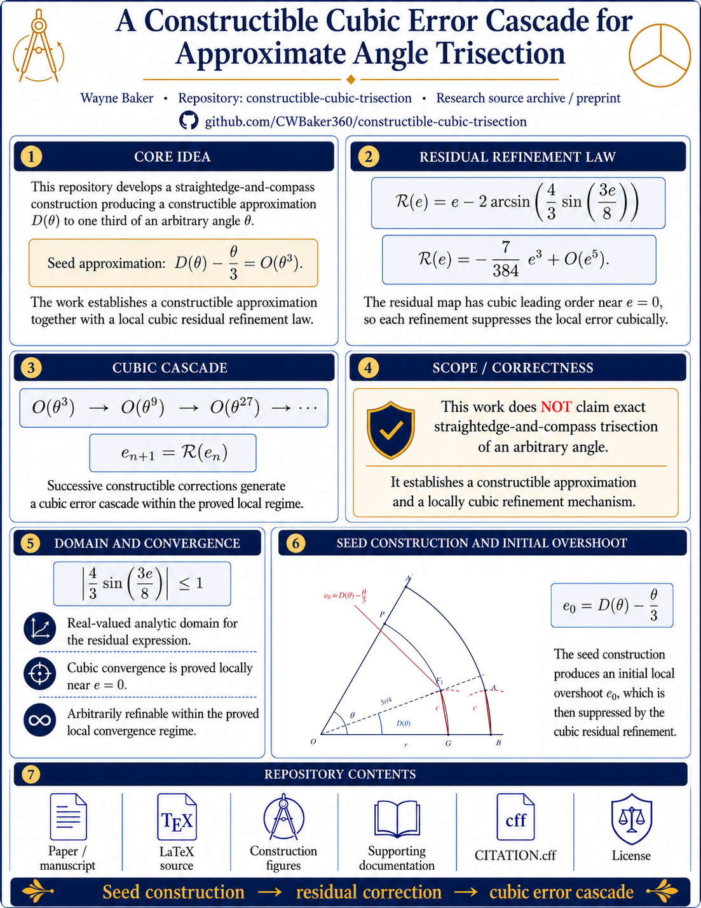

<p align="center">
  
</p>

# A Constructible Cubic Error Cascade for Approximate Angle Trisection

**Author:** Wayne Baker  
**Repository:** `constructible-cubic-trisection`  
**Version:** 1.0.1  
**Maintenance release date:** July 23, 2026 
**Repository package date:** July 18, 2026  
**Maintenance release date:** July 22, 2026  
**Status:** Preprint / research source archive

This repository contains the paper, LaTeX source, reproducibility scripts, numerical outputs, citation metadata, and supporting documentation for:

> **A Constructible Cubic Error Cascade for Approximate Angle Trisection**

## Read the paper

- [Compiled preprint PDF](paper/constructible_cubic_trisection.pdf)
- [LaTeX source](paper/constructible_cubic_trisection.tex)
- [Paper-source notes](paper/README.md)
- [Latest release](https://github.com/CWBaker360/Constructible-Cubic-Trisection/releases/latest)

## Main result

The paper develops a straightedge-and-compass construction producing a constructible approximation \(D(\theta)\) to one third of a given angle \(\theta\). The seed error satisfies

$$
D(\theta)-\frac{\theta}{3}
=
\frac{7}{10368}\theta^3+O(\theta^5),
$$

with asymptotic formulae expressed in radians.

For a signed approximation error \(e\), the residual map is

$$
\mathscr{R}(e)
=
e-2\arcsin\!\left(\frac{4}{3}\sin\frac{3e}{8}\right),
$$

and its local expansion is

$$
\mathscr{R}(e)
=
-\frac{7}{384}e^3+O(e^5).
$$

Consequently, the successive local error orders are

$$
O(\theta^3)\longrightarrow O(\theta^9)
\longrightarrow O(\theta^{27})\longrightarrow\cdots.
$$

## Scope and correctness

This work does **not** claim exact straightedge-and-compass trisection of an arbitrary angle. The classical impossibility theorem remains unchanged. The result is an arbitrarily refinable sequence of finite Euclidean approximants within the proved local regime.

The trigonometric notation is an analytic representation of Euclidean operations. Sine values are represented by directed projection lengths on a reference circle, rational scaling is performed with similar triangles, and the corresponding angle is recovered by a right-triangle construction.

## Mathematical context

Rouben Rostamian's exposition of Baker's construction records the seed formula, its cubic leading error, and the first iterative improvement. The paper in this repository formulates the construction as a residual operator, derives the local cubic residual law, and records the resulting finite-stage error cascade.

- [Rostamian: *An angle trisection - Construction by Wayne Baker*](https://userpages.umbc.edu/~rostamia/Geometry/trisect-baker.html)

## Research triad

This paper is the first work in a three-paper research sequence:

1. [A Constructible Cubic Error Cascade for Approximate Angle Trisection](https://github.com/CWBaker360/Constructible-Cubic-Trisection/releases/latest)
2. [A Local Cubic Refinement Law for Proportional-Subtended Angle Division](https://github.com/CWBaker360/proportional-subtended-cubic-refinement/releases/latest)
3. [A Constructive N-Series Acceleration Law for Polygonal Approximation of π](https://github.com/CWBaker360/N-Series-pi-acceleration/releases/latest)

Together, the three papers develop the progression

**constructible approximation → local cubic refinement → higher-order acceleration**.

The first paper presents a specific straightedge-and-compass approximation and
its cubic error cascade. The second derives the general proportional-subtended
cancellation law and proves the uniqueness of the scaling that removes the
linear residual term. The third applies structured asymptotic cancellation to
accelerate polygonal approximations of π.

## Reproducibility

The exact series coefficients and numerical consistency table can be reproduced with the included scripts:

```bash
python -m pip install -r requirements.txt
python scripts/verify_series.py
python scripts/numerical_consistency_check.py --output-dir outputs
```

The numerical script uses 100 decimal digits of working precision. Committed reference outputs are included under [`outputs/`](outputs/).

See [REPRODUCIBILITY.md](REPRODUCIBILITY.md) for details.

## Repository layout

```text
.
├── README.md
├── CITATION.cff
├── CHANGELOG.md
├── LICENSE
├── LICENSE-PAPER.md
├── LICENSE_NOTICE.MD
├── REPRODUCIBILITY.md
├── MANIFEST.txt
├── SHA256SUMS.txt
├── requirements.txt
├── assets/
│   └── Repo01_constructible-cubic-trisection.png
├── paper/
│   ├── constructible_cubic_trisection.pdf
│   ├── constructible_cubic_trisection.tex
│   └── README.md
├── scripts/
│   ├── numerical_consistency_check.py
│   └── verify_series.py
├── outputs/
│   ├── numerical_consistency_report.txt
│   ├── numerical_consistency_summary.csv
│   └── symbolic_verification.txt
├── docs/
│   ├── abstract.md
│   ├── github_upload_checklist.md
│   ├── release_notes_v1.0.0.md
│   ├── repository_description.md
│   └── revision_report_2026-07-18.md
└── figures/
```

## Build instructions

From the repository root:

```bash
cd paper
pdflatex constructible_cubic_trisection.tex
pdflatex constructible_cubic_trisection.tex
```

Run LaTeX twice so references settle correctly.

## Citation

Citation metadata is provided in [`CITATION.cff`](CITATION.cff). On GitHub, this enables the **Cite this repository** control.

A DOI can be added to `CITATION.cff` after the tagged GitHub release is archived.

## License

This repository uses a dual-license structure:

- paper text, figures, documentation, and supplementary written materials are licensed under [CC BY 4.0](LICENSE-PAPER.md);
- source code is licensed under the [MIT License](LICENSE).

See [LICENSE_NOTICE.MD](LICENSE_NOTICE.MD) for the scope summary.
